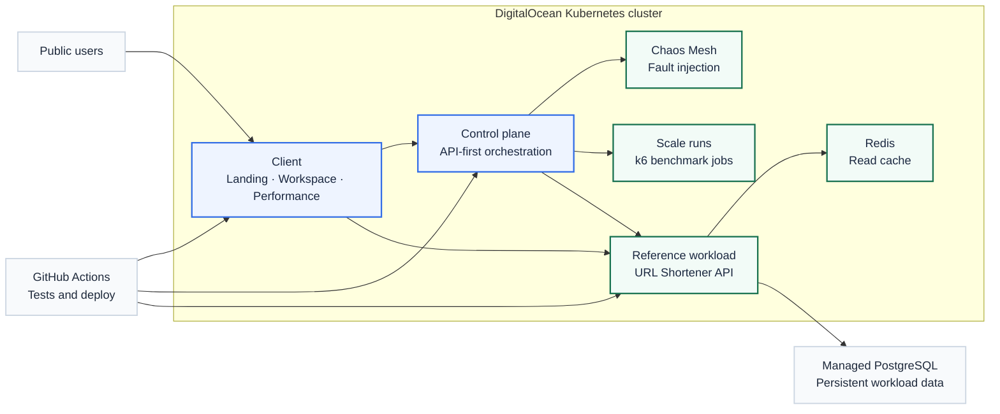
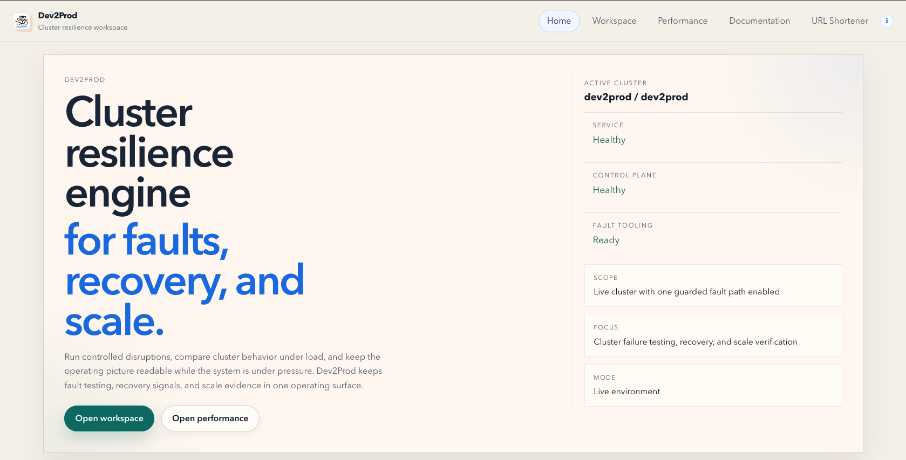
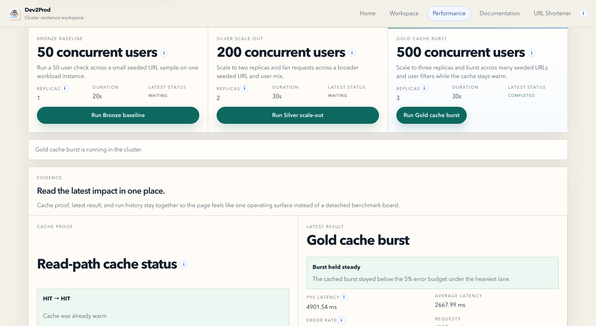
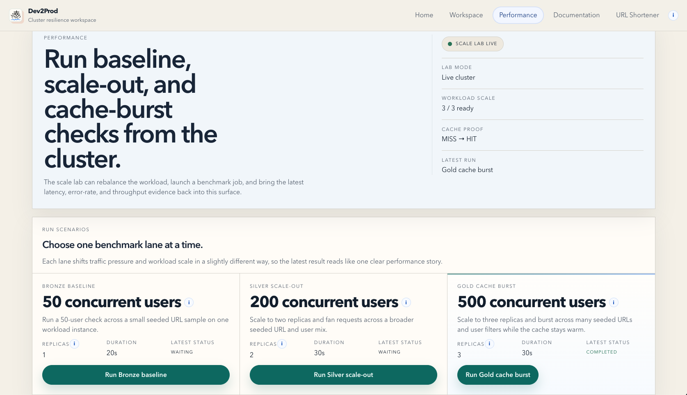

# Dev2Prod

<p align="center"><strong>Controlled chaos and scale lab for Kubernetes workloads</strong></p>

<p align="center">
  Dev2Prod turns resilience and scalability work into guided product flows so a team can break a deployment on purpose,
  watch what recovers, and understand where the system bends before production has to teach the lesson the hard way.
</p>

<table align="center">
  <tr>
    <td align="center" width="160">
      <a href="https://dev2prod.sanjaybaskaran.dev"><strong>Landing</strong></a><br/>
      <sub>product overview</sub>
    </td>
    <td align="center" width="190">
      <a href="https://dev2prod.sanjaybaskaran.dev/shortener/"><strong>Reference workload</strong></a><br/>
      <sub>live proof surface</sub>
    </td>
    <td align="center" width="160">
      <a href="https://dev2prod.sanjaybaskaran.dev/workspace"><strong>Workspace</strong></a><br/>
      <sub>reliability flow</sub>
    </td>
    <td align="center" width="160">
      <a href="https://dev2prod.sanjaybaskaran.dev/performance"><strong>Performance</strong></a><br/>
      <sub>scale lab</sub>
    </td>
  </tr>
</table>

|  |  |  |
| --- | --- | --- |
| **Reliability**<br/>Guided chaos drills, recovery watch, and evidence that stays tied to the workload story. | **Scalability**<br/>Baseline, scale-out, and cache-burst lanes that turn benchmark output into readable proof. | **Platform direction**<br/>One React client today, with an API-first control plane that can later support other interfaces. |

## Platform At A Glance



Source: [platform-overview.mmd](docs/assets/diagrams/platform-overview.mmd)

## The Story Behind The Platform

Dev2Prod is built around a simple belief: if a deployment only looks healthy when nothing goes wrong, that is not enough.

We intentionally kept the reference workload basic. The URL shortener is there to make the platform legible, not to compete with it. The serious work went into the infrastructure around it: the control plane, the cluster flows, the recovery signals, the scale lab, the cache story, and the operator experience.

We also did not want to treat the quest list as a strict checklist. The goal was to use the project as an opportunity to build something that still feels relevant to reliability, scalability, and SRE work. We have both been in situations where a setup felt ready until it broke at the worst possible time. Dev2Prod is the attempt to make that lesson happen before production, not after it.

## Live Demo

Primary demo surfaces:

- Landing page: [dev2prod.sanjaybaskaran.dev](https://dev2prod.sanjaybaskaran.dev)
- Reference workload: [dev2prod.sanjaybaskaran.dev/shortener/](https://dev2prod.sanjaybaskaran.dev/shortener/)

Secondary operator surfaces:

- Workspace: [dev2prod.sanjaybaskaran.dev/workspace](https://dev2prod.sanjaybaskaran.dev/workspace)
- Performance: [dev2prod.sanjaybaskaran.dev/performance](https://dev2prod.sanjaybaskaran.dev/performance)

<table>
  <tr>
    <td align="center" width="33%">
      
      <br />
      <sub><strong>Landing</strong>: product framing, cluster status, and the main entry points.</sub>
    </td>
    <td align="center" width="33%">
      
      <br />
      <sub><strong>Workspace</strong>: guided faults, active target context, and recovery visibility.</sub>
    </td>
    <td align="center" width="33%">
      
      <br />
      <sub><strong>Performance</strong>: benchmark lanes, workload scale, and live cache proof.</sub>
    </td>
  </tr>
</table>

## Quick Start

Install backend dependencies:

```bash
uv sync --group dev
```

Bring up the local stack:

```bash
docker compose -f infra/local/compose.yaml --profile scale up --build
```

Local endpoints:

- cockpit: `http://127.0.0.1:14000`
- workload API: `http://127.0.0.1:15000`
- control plane: `http://127.0.0.1:18000`

If you want the React client with live reload:

```bash
cd client
npm install
npm run dev
```

## What The Product Surfaces Do

### Workspace

Workspace is the reliability surface.

It keeps the target explicit, runs one fault at a time, and turns recovery into a readable sequence instead of scattered raw signals.

### Performance

Performance is the scalability surface.

It runs benchmark lanes, shows cache behavior, and turns the result into a readable before-and-after story.

### Reference workload

The shortener page is the proof surface.

It gives the platform something concrete to keep alive, slow down, or scale around.

## Documentation Quest Coverage

| Tier | Documentation focus | Where it lives |
| --- | --- | --- |
| Bronze | Clear README, architecture diagram, API docs | This README, [docs/platform.md](docs/platform.md), [docs/api.md](docs/api.md) |
| Silver | Deploy guide, rollback path, troubleshooting, config | [docs/deploy.md](docs/deploy.md), [docs/troubleshooting.md](docs/troubleshooting.md), [docs/config.md](docs/config.md) |
| Gold | Runbooks, decision log, capacity plan | [docs/runbooks.md](docs/runbooks.md), [docs/decision-log.md](docs/decision-log.md), [docs/capacity-plan.md](docs/capacity-plan.md) |

## Reliability

The reliability story centers on guided chaos drills in Workspace:

- `Pod restart` proves the platform can recover from a deliberate pod kill.
- `CPU pressure` shows how the service behaves when one pod is stressed.
- `Network latency` shows controlled degradation under slower network conditions.

Read more:

- [Reliability doc](docs/reliability.md)
- [Demo guide](docs/demo.md)
- [Runbooks](docs/runbooks.md)

## Scalability

The scalability story is built around three benchmark lanes:

- Bronze baseline
- Silver scale-out
- Gold cache burst

Those lanes combine workload scaling, benchmark jobs, and Redis-backed read caching so the platform can show:

- starting latency and error rate
- the effect of horizontal scale
- the effect of caching under heavier burst traffic

Read more:

- [Scalability doc](docs/scalability.md)
- [Capacity plan](docs/capacity-plan.md)
- [Evidence placeholders](docs/evidence.md)

## Platform Direction

Dev2Prod was shaped around active quest constraints, but the product direction is broader.

The control plane is intentionally API-first. The current React client is one interface over that engine, not the only possible interface. The longer-term direction is:

- a headless control plane
- safe onboarding for workloads beyond the reference app
- broader Chaos Mesh fault coverage
- richer cluster visibility
- additional interfaces, including a CLI

The goal is not to hide the system. The goal is to abstract the operational ceremony into guided flows that more people can actually use.

## Repository Guide

Start here:

- [Docs index](docs/index.md)
- [Platform narrative](docs/platform.md)
- [Reliability](docs/reliability.md)
- [Scalability](docs/scalability.md)
- [API docs](docs/api.md)
- [Deploy guide](docs/deploy.md)
- [Troubleshooting](docs/troubleshooting.md)
- [Config reference](docs/config.md)
- [Runbooks](docs/runbooks.md)
- [Decision log](docs/decision-log.md)
- [Capacity plan](docs/capacity-plan.md)
- [Evidence placeholders](docs/evidence.md)

Implementation references:

- [DigitalOcean delivery](infra/digitalocean/README.md)

## Community Files

- [License](LICENSE)
- [Contributing guide](CONTRIBUTING.md)
- [Code of conduct](CODE_OF_CONDUCT.md)
- [Security policy](SECURITY.md)
- [AI usage](AI_USAGE.md)
- [Agent instructions](AGENTS.md)
- [Local stack](infra/local/README.md)

## Meta Engineering Articles That Closely Relate

Two Meta Engineering articles that closely relate to the direction of this project:

- [Scaling services with Shard Manager](https://engineering.fb.com/2020/08/24/production-engineering/scaling-services-with-shard-manager/)
- [BellJar: A new framework for testing system recoverability at scale](https://engineering.fb.com/2022/05/05/developer-tools/belljar/)

They are not the blueprint for Dev2Prod, but they are useful examples of treating scale and resilience as real production problems rather than abstract exercises.
