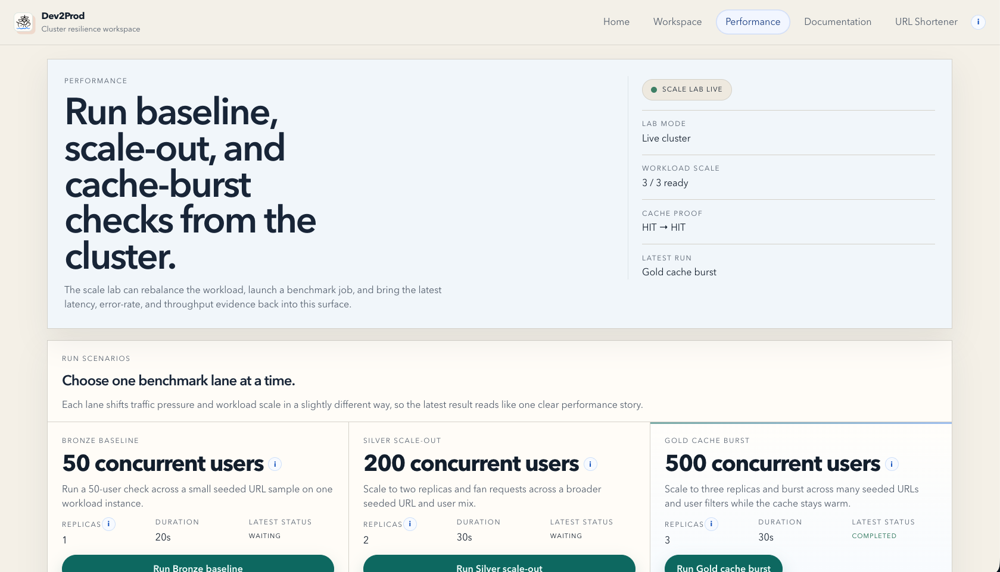

# Capacity Plan

  
  &nbsp;<strong>What is proven today and where the system bends first</strong>

This is not a universal production SLA. It is the current demonstrated capacity story for the reference workload and the benchmark lanes that ship with Dev2Prod.

  
   
  The scale lab turns benchmark output into one readable result surface with cache proof, latency, error rate, and throughput together.

## Current Proven Benchmarks

| Lane | Traffic shape | Replicas | P95 latency | Avg latency | Error rate | Throughput | Requests |
| --- | --- | --- | --- | --- | --- | --- | --- |
| Bronze baseline | 50 concurrent users | 1 | 731.82 ms | 310.05 ms | 0.00% | 36.76 req/s | 789 |
| Silver scale-out | 200 concurrent users | 2 | 2169.67 ms | 1208.6 ms | 2.08% | 86.39 req/s | 2791 |
| Gold cache burst | 500 concurrent users | 3 | 4901.54 ms | 2667.99 ms | 2.65% | 122.77 req/s | 4305 |

## What These Numbers Mean

- Bronze gives the baseline before any scale-out or cache help is applied.
- Silver shows the scale-out lane staying within the documented 3s p95 and 5% error targets.
- Gold shows the heaviest cache-aware lane staying under the 5% error budget while delivering the highest throughput of the three runs.

## What Bends First

The first meaningful pressure points found during the project were:

1. database connection pressure under burst traffic
2. probe sensitivity during network-delay drills
3. UI clarity when a drill completed too quickly for the workspace to narrate it well

## Current Limits

The current live shape is still intentionally scoped:

- one cluster namespace
- one reference workload
- one guarded fault target
- one public client surface

That means the product demonstrates controlled resilience and scalability well, but it is not yet a general multi-workload platform.

## What Extends The Limit

The next meaningful platform steps are:

- headless control-plane expansion
- workload onboarding beyond the reference app
- broader fault coverage
- more cluster-level context
- more automation and CLI-friendly flows
