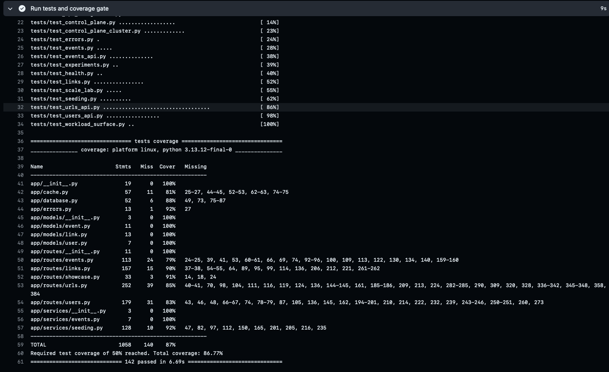
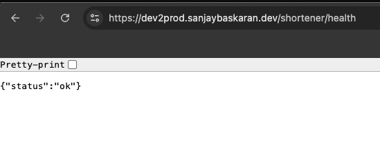
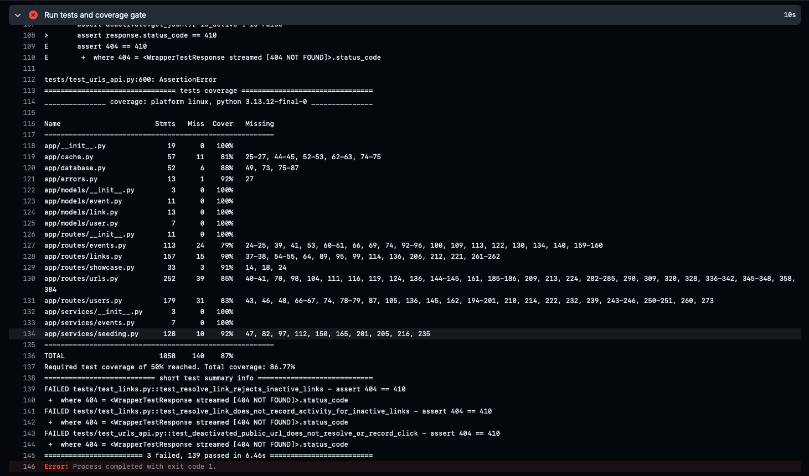
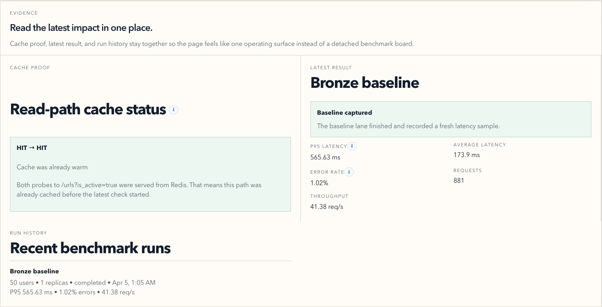
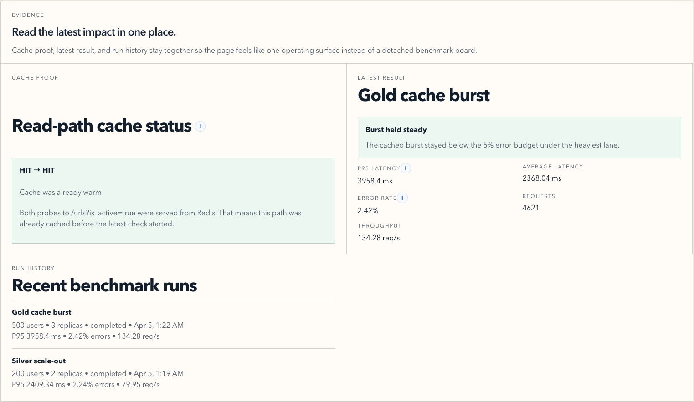
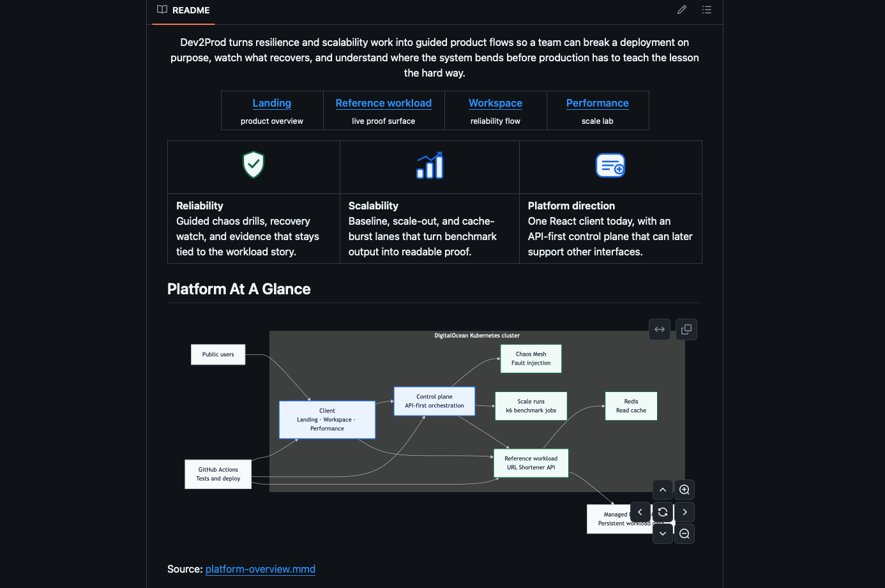

# Evidence Plan

  
  &nbsp;<strong>Submission-ready links, screenshots, and notes</strong>

This file is the working evidence sheet for the submission form. Each section below maps to one quest tier and records:

- the best link to attach
- the screenshot or video that supports it
- the short note that explains what the evidence proves

## Reliability

### Bronze

**Link**

- [Tests and Gate workflow run](https://github.com/sanjayb-28/Team-Dev2Prod-PE-Hack/actions/runs/23996027297)

**Image / video**

<table>
  <tr>
    <td align="center" width="50%">
      
       
      <strong>CI gate</strong>: automated tests and coverage passing in GitHub Actions.
    </td>
    <td align="center" width="50%">
      
       
      <strong>Health pulse</strong>: public workload health check returning <code>{"status":"ok"}</code>.
    </td>
  </tr>
</table>

**Notes**

- Automated tests run before release, coverage is enforced in CI, and the workload exposes a live `/health` pulse check.

### Silver

**Link**

- [Tests and Gate job view](https://github.com/sanjayb-28/Team-Dev2Prod-PE-Hack/actions/runs/23996027297/job/69984127615)

**Image / video**

  
   
  <strong>Blocked gate</strong>: a failing test run stops the release path before broken code can move forward.

**Notes**

- The release gate blocks when tests fail, coverage remains visible in CI, and the public API returns structured JSON errors for invalid, missing, or inactive resources.

### Gold

**Link**

- [Workspace recovery demo](https://www.loom.com/share/01e5d8258899486aa2f99ba0d7240f06)

**Image / video**

- Loom recording linked above

**Notes**

- Workspace shows a deliberate fault, live recovery signals, and the reference workload staying readable while the cluster returns to a healthy state.

## Scalability

### Bronze

**Link**

- [Scalability implementation guide](https://github.com/sanjayb-28/Team-Dev2Prod-PE-Hack/blob/main/docs/scalability.md)

**Image / video**

  
   
  <strong>Bronze baseline</strong>: the starting latency and error-rate profile before scale-out and cache help are applied.

**Notes**

- Baseline lane simulates 50 concurrent users and records the starting latency, error rate, request count, and throughput in one readable surface.

### Silver

**Link**

- [Silver scale-out demo](https://www.loom.com/share/6b63bbf844cd486b8ce725fb08069581)

**Image / video**

- Loom recording linked above

**Notes**

- Silver scale-out runs the workload behind a traffic-splitting layer and shows how the platform behaves at the 200-user lane with multiple app instances.

### Gold

**Link**

- [Capacity plan](https://github.com/sanjayb-28/Team-Dev2Prod-PE-Hack/blob/main/docs/capacity-plan.md)

**Image / video**

  
   
  <strong>Gold cache burst</strong>: the cache-aware heavy lane, with recent benchmark history visible beside the latest result.

**Notes**

- Gold uses Redis-backed reads and the heaviest benchmark lane to show cache proof, burst stability, and the throughput gain after database-connection pressure was addressed.

## Documentation

### Bronze

**Link**

- [README](https://github.com/sanjayb-28/Team-Dev2Prod-PE-Hack/blob/main/README.md)

**Image / video**

  
   
  <strong>README overview</strong>: top-level project framing, demo links, platform summary, and architecture diagram.

**Notes**

- The README gives setup context, demo entry points, architecture framing, and a direct path into the platform and API docs.

### Silver

**Link**

- [Deploy guide](https://github.com/sanjayb-28/Team-Dev2Prod-PE-Hack/blob/main/docs/deploy.md)
- [Troubleshooting guide](https://github.com/sanjayb-28/Team-Dev2Prod-PE-Hack/blob/main/docs/troubleshooting.md)
- [Config reference](https://github.com/sanjayb-28/Team-Dev2Prod-PE-Hack/blob/main/docs/config.md)

**Image / video**

- Pending capture

**Notes**

- Silver documentation covers how the platform is deployed, how a rollback is performed, how common failures are diagnosed, and which environment variables control the live system.

### Gold

**Link**

- [Runbooks](https://github.com/sanjayb-28/Team-Dev2Prod-PE-Hack/blob/main/docs/runbooks.md)
- [Decision log](https://github.com/sanjayb-28/Team-Dev2Prod-PE-Hack/blob/main/docs/decision-log.md)
- [Capacity plan](https://github.com/sanjayb-28/Team-Dev2Prod-PE-Hack/blob/main/docs/capacity-plan.md)

**Image / video**

- Pending capture

**Notes**

- Gold documentation covers operational runbooks, the real technical tradeoffs behind the platform shape, and the measured capacity story for the benchmark lanes.
