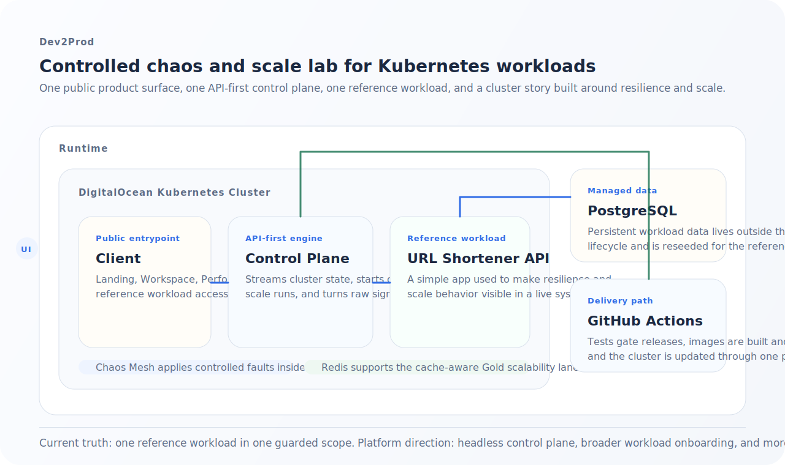

# Dev2Prod Platform Narrative

Dev2Prod is a controlled chaos and scale lab for Kubernetes workloads.

It is meant to make resilience and scalability work easier to understand, easier to run, and easier to explain without reducing the system to a black box.

## In Plain Language

If a deployment only looks healthy when nothing goes wrong, that is not enough.

Dev2Prod exists to answer a more useful question:

What happens when the system is under pressure, when a pod disappears, when traffic grows, or when the network gets worse than expected?

The platform brings those checks into one guided surface so the user does not have to jump between:

- cluster commands
- raw logs
- benchmark output
- deployment status screens
- separate infrastructure tools

The point is not to remove engineering judgment. The point is to make the process clearer and more accessible.

## Current Product Truth

The live product is intentionally scoped.

Today, the demo runs against one reference workload inside one cluster namespace. That is a guardrail, not the product thesis.

The current experience is designed to show three things clearly:

1. A fault can be introduced on purpose.
2. The cluster response can be watched in real time.
3. The user-facing workload can be checked while the platform is still doing the operational work.

## Why The Reference Workload Is Basic

The reference workload is a URL shortener, and it is intentionally simple.

That choice was deliberate. We did not want the sample app to absorb the time and attention that should have gone into:

- infrastructure shape
- deployment workflow
- resilience behavior
- scale testing
- cache behavior
- guided operator experience

The shortener is here to make the platform legible. The serious work is in the system around it.

## The Product We Wanted To Build

We did not want to treat the quest list as a strict checklist.

The goal was to use the opportunity to build something we would actually be proud to explain: a platform that still feels relevant to someone doing reliability, scalability, or SRE work.

We have both been in situations where a setup felt production-ready until it failed at the worst possible time. That is the feeling this platform is trying to address.

The ideal outcome is simple:

- break it before production does
- understand what happened
- earn confidence before the 2 a.m. incident

## Architecture Overview

### What This Diagram Shows

- the `client` is the public entrypoint
- the `control-plane` is the API-first orchestration layer
- the `workload-api` is the reference workload
- `Chaos Mesh` injects controlled faults
- `Redis` supports cached read paths for the scale story
- managed PostgreSQL stores the workload data
- GitHub Actions deploys the full shape into the cluster

## Product Surfaces

### Landing

The landing page explains the platform and routes the reader into the main flows.

### Workspace

Workspace is the reliability surface.

It keeps the fault target explicit, shows recovery signals, and attaches evidence and logs directly to the drill that is running.

### Performance

Performance is the scalability surface.

It runs baseline, scale-out, and cache-burst checks and turns the benchmark output into a readable story.

### Reference Workload

The shortener page is the user-facing proof surface.

It gives the platform something concrete to keep alive, slow down, or scale around.

## Current Scope And Next Direction

The current implementation is shaped by the active quest constraints, but the platform direction is broader.

### What Comes Next

1. A headless control plane

The control plane is already structured as an API-first engine. The current React app is one client over that layer, not the only possible interface.

Future interfaces could include:

- another web client
- internal dashboards
- automation integrations
- a CLI client

2. Bring-your-own workload

The long-term platform direction is to let users point Dev2Prod at their own cluster workload instead of a locked reference target.

That means safe onboarding, scope validation, workload mapping, and guided targeting rather than one hardcoded app.

3. Broader fault coverage

The current fault set is a starting point, not the final platform surface.

The direction is to support more chaos patterns while keeping the experience understandable for non-experts.

4. Better cluster visibility

The platform should expose richer health and recovery information without turning into a noisy admin console.

## Frontend Direction

The frontend was intentionally kept lighter than a heavier opinionated app stack.

That choice connects directly to the product direction: if the control plane is meant to stay headless, the first client should be a straightforward interface over the API rather than a tightly coupled framework-heavy shell.

That leaves room for:

- a simple React client today
- a CLI client later
- other interfaces without rewriting the platform core

## Relevant Reading

Two Meta Engineering articles are especially close to the spirit of this project:

- [Scaling services with Shard Manager](https://engineering.fb.com/2020/08/24/production-engineering/scaling-services-with-shard-manager/)
- [FOQS: Making a distributed priority queue disaster-ready](https://engineering.fb.com/2022/01/18/production-engineering/foqs-disaster-ready/)

They are not direct implementation templates here. They are useful examples of treating scale and resilience as real operational problems that deserve product-quality explanation.

## Quick Glossary

**Control plane**  
The part of the platform that decides what to run, what to inspect, and what to report back.

**Reference workload**  
The sample application used to demonstrate the platform in the live environment.

**Chaos drill**  
A short, intentional fault run used to observe recovery and resilience.

**Scale lane**  
A named benchmark scenario with a specific traffic level and workload shape.

**Headless**  
An API-first backend that can support more than one user interface.
