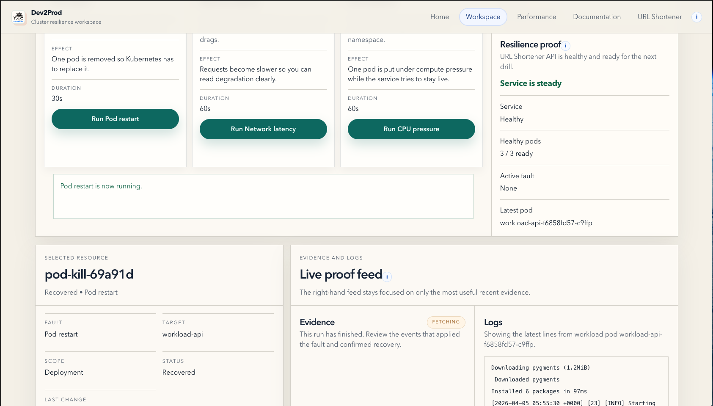
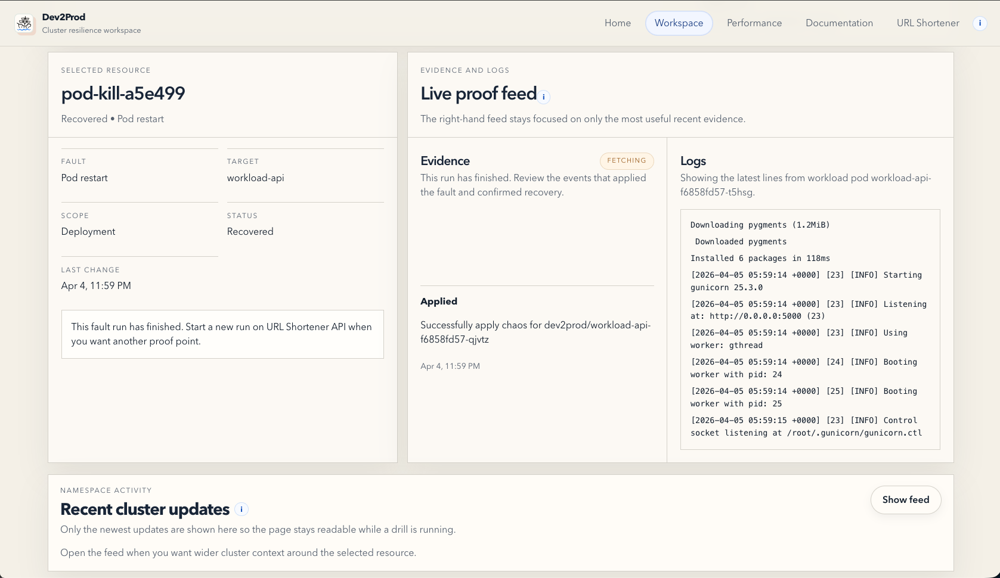

# Reliability

  
  &nbsp;<strong>Guided recovery workflow</strong>

Dev2Prod approaches reliability as a guided fault-and-recovery workflow.

The goal is not only to trigger failures. The goal is to make the response legible.

## In Plain Language

Reliability work starts with a simple question:

If something breaks on purpose, can the system stay useful and can the team understand what happened?

The Workspace page is designed to answer that with one flow:

1. pick the active target
2. run one temporary fault
3. watch recovery
4. inspect evidence

## Reliability Flow

Source: [reliability-flow.mmd](assets/diagrams/reliability-flow.mmd)

<table>
  <tr>
    <td align="center" width="50%">
      
       
      <strong>Active drill</strong>: the fault action, current service state, and recovery story are visible at once.
    </td>
    <td align="center" width="50%">
      
       
      <strong>Evidence and logs</strong>: events and workload logs stay attached to the selected drill.
    </td>
  </tr>
</table>

## Fault Types

| Fault | What it does | What it proves |
| --- | --- | --- |
| Pod restart | Kills one running workload pod. | The deployment controller can replace the pod and the cluster can move back to a steady state. |
| CPU pressure | Applies CPU stress to one workload pod. | The service can stay useful under pressure and the platform can surface degraded conditions before they become mystery failures. |
| Network latency | Injects request delay into the workload path. | The platform can show controlled degradation, not only binary failure. |

## Tier Mapping

### Bronze

Implemented proof:

- `/health`
- automated test gate in GitHub Actions
- test runs on every push and PR

### Silver

Implemented proof:

- coverage gate in CI
- integration testing around the API
- deployment only proceeds when the test gate passes
- documented 404 and validation error handling

### Gold

Implemented proof:

- live chaos drills through Chaos Mesh
- graceful JSON error handling across the public API
- visible recovery behavior in Workspace and the reference workload
- failure behavior documented in the manual pages below

## How We Implemented It

Open the implementation notes

High-level implementation choices:

- Flask workload and Flask-based control plane
- GitHub Actions for tests, coverage, and deploy gating
- Chaos Mesh for controlled fault injection
- DigitalOcean Kubernetes for the live cluster
- UI-driven evidence instead of raw operational output only

Key repo references:

- [control_plane/experiments.py](/Users/sanjaybaskaran/Developer/Team-Dev2Prod-PE-Hack/control_plane/experiments.py)
- [control_plane/cluster.py](/Users/sanjaybaskaran/Developer/Team-Dev2Prod-PE-Hack/control_plane/cluster.py)
- [tests/test_control_plane.py](/Users/sanjaybaskaran/Developer/Team-Dev2Prod-PE-Hack/tests/test_control_plane.py)
- [tests/test_control_plane_cluster.py](/Users/sanjaybaskaran/Developer/Team-Dev2Prod-PE-Hack/tests/test_control_plane_cluster.py)

## Failure Manual

When a drill is active, the expected operator path is:

1. confirm the target is the guarded workload
2. start one drill
3. watch `Recovery watch` and `Resilience proof`
4. inspect evidence and logs
5. verify the reference workload remains useful or clearly degraded

Supporting docs:

- [Runbooks](runbooks.md)
- [Troubleshooting](troubleshooting.md)
- [Demo guide](demo.md)

## What Expands Next

The current fault set is intentionally small.

The next step is not more buttons. It is broader supported fault coverage through the same guided model:

- more Chaos Mesh experiment types
- better workload targeting
- richer recovery and continuity signals

## Evidence Placeholders

Use the reliability tier placeholders in [evidence.md](evidence.md#reliability).
