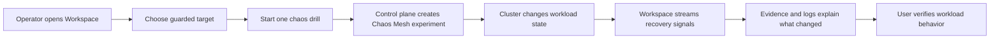

# Reliability

Dev2Prod approaches reliability as a guided fault-and-recovery workflow.

The goal is not only to trigger failures. The goal is to make the response legible.

## In Plain Language

Reliability work starts with a simple question:

If something breaks on purpose, can the system stay useful and can the team understand what happened?

The workspace is designed to answer that with one flow:

1. pick the active target
2. run one temporary fault
3. watch recovery
4. inspect evidence

## Reliability Flow

Diagram source: [reliability-flow.mmd](assets/diagrams/reliability-flow.mmd)

> Screenshot placeholder: workspace during active pod restart  
> Screenshot placeholder: resilience proof and recovery watch

## Fault Types

### Pod restart

What it does:
- kills one running workload pod

What it proves:
- the deployment controller can replace the pod
- the cluster can move back to a steady state

Best demo inference:
- a pod disappeared, the platform replaced it, and the workload recovered

### CPU pressure

What it does:
- applies CPU stress to one workload pod

What it proves:
- the service can stay useful under pressure
- the platform can surface degraded conditions before they become mystery failures

Best demo inference:
- one pod was pressured, but the service stayed understandable and observable

### Network latency

What it does:
- injects request delay into the workload path

What it proves:
- the platform can show controlled degradation, not only binary failure

Best demo inference:
- the app slowed down on purpose, and the user could see that change clearly

## How The Workspace Shows Reliability

The workspace keeps reliability readable by combining:

- a clear active target
- fault controls in one action zone
- recovery watch
- resilience proof
- evidence and logs

The intent is to avoid scattering the story across raw Kubernetes views.

## Tier Mapping

### Bronze

Implemented proof:
- `/health`
- automated test gate in GitHub Actions
- test runs on every push and PR

### Silver

Implemented proof:
- coverage gate in CI
- integration testing around the API
- deployment only proceeds when the test gate passes

### Gold

Implemented proof:
- live chaos drills through Chaos Mesh
- graceful JSON error handling across the public API
- visible recovery behavior in the workspace and the reference workload

## Implementation Notes

High-level implementation choices:

- Flask workload and control plane
- GitHub Actions for tests and deploy gating
- Chaos Mesh for controlled fault injection
- DigitalOcean Kubernetes for the live cluster
- UI-driven evidence instead of raw operational output only

## What Expands Next

The current fault set is intentionally small.

The next step is not “more buttons.” It is broader supported fault coverage through the same guided model:

- more Chaos Mesh experiment types
- better workload targeting
- richer recovery and continuity signals

## Evidence Placeholders

Use the tier placeholders in [evidence.md](evidence.md#reliability).
