# Scalability

  
  &nbsp;<strong>Guided benchmark workflow</strong>

Dev2Prod treats scalability as a guided benchmark story, not a raw load-test terminal dump.

The Performance surface exists to make benchmark lanes understandable for someone who is trying to answer a practical question:

Can this workload absorb more traffic, and what changes actually help?

## In Plain Language

Scalability work in this project is organized into three steps:

1. establish a baseline
2. scale the workload out
3. reduce repeated read pressure with caching

The point is not to claim infinite scale. The point is to show where the workload performs well, where it bends, and what kind of improvement actually changes the result.

## Scalability Flow

```mermaid
flowchart LR
    Start["Performance opens"] --> Lane["One benchmark lane is selected"]
    Lane --> Run["Control plane starts the scale run"]
    Run --> Apply["Cluster applies scale and benchmark jobs"]
    Apply --> Measure["k6 records latency, errors, and throughput"]
    Measure --> Summarize["Control plane collects the run summary"]
    Summarize --> Read["Performance surface shows the latest impact"]

    classDef neutral fill:#F8FAFC,stroke:#CBD5E1,color:#1E293B,stroke-width:1.6px;
    classDef scale fill:#EEF4FF,stroke:#326DE6,color:#1B2840,stroke-width:2px;
    classDef optimize fill:#F2FBF7,stroke:#17714F,color:#1B2840,stroke-width:2px;

    class Start,Read neutral
    class Lane,Run,Summarize scale
    class Apply,Measure optimize
```

Source: [scalability-flow.mmd](assets/diagrams/scalability-flow.mmd)

> Screenshot placeholder: performance page with benchmark lanes  
> Screenshot placeholder: Gold cache burst result and cache proof

## Benchmark Lanes

| Lane | Traffic goal | What it proves |
| --- | --- | --- |
| Bronze baseline | 50 concurrent users | Establishes the starting p95 latency and error rate. |
| Silver scale-out | 200 concurrent users | Shows whether horizontal scaling changes the result in a measurable way. |
| Gold cache burst | 500 concurrent users or 100 req/sec lane shape | Shows whether caching changes the burst story, not only the replica count. |

## Tier Mapping

### Bronze

Implemented proof:

- k6 benchmark lane
- starting latency and error-rate capture
- clearly documented p95 language in the Performance surface

### Silver

Implemented proof:

- multi-replica workload lane
- Nginx-based scale-out path in the local lab
- performance result comparison in the client

### Gold

Implemented proof:

- Redis-backed read cache
- cache proof surfaced in the UI
- cached heavy-burst lane and resulting error-rate and throughput summary
- bottleneck analysis around database connection pressure and pooling

## Bottleneck Story

The project found a real bottleneck during the Gold lane: repeated database pressure and connection exhaustion made the heavy burst fail noisily even when Redis was already present.

The fix was not more marketing. It was real runtime work:

- use pooled PostgreSQL connections
- stop opening a fresh database connection on every request path
- keep cached read paths away from unnecessary database work

That shifted Gold from a failing burst to a stable cache-aware lane.

## How We Implemented It

Open the implementation notes

High-level implementation choices:

- k6-driven benchmark lanes
- control-plane initiated scale runs inside the cluster
- Redis cache for read-heavy paths
- benchmark summaries surfaced in the client instead of left in raw logs only

Key repo references:

- [control_plane/scale_lab.py](/Users/sanjaybaskaran/Developer/Team-Dev2Prod-PE-Hack/control_plane/scale_lab.py)
- [app/cache.py](/Users/sanjaybaskaran/Developer/Team-Dev2Prod-PE-Hack/app/cache.py)
- [app/database.py](/Users/sanjaybaskaran/Developer/Team-Dev2Prod-PE-Hack/app/database.py)
- [infra/local/compose.yaml](/Users/sanjaybaskaran/Developer/Team-Dev2Prod-PE-Hack/infra/local/compose.yaml)

## Production Path

The current scale lab is built around one reference workload and one guided benchmark surface.

The broader direction is:

- workload onboarding beyond the reference app
- richer lane configuration
- more cluster-wide context
- a headless benchmark and control API that can support other clients

## Capacity And Evidence

- [Capacity plan](capacity-plan.md)
- [Evidence placeholders](evidence.md#scalability)
