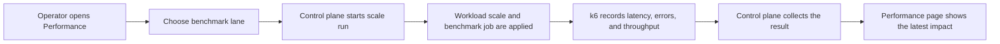

# Scalability

Dev2Prod treats scalability as a guided benchmark story, not a raw load-test terminal dump.

The Performance surface exists to make benchmark lanes understandable for someone who is trying to answer a practical question:

Can this workload absorb more traffic, and what changes actually help?

## In Plain Language

Scalability work in this project is organized into three steps:

1. establish a baseline
2. scale the workload out
3. reduce repeated read pressure with caching

The point is not to claim infinite scale. The point is to show where the workload performs well, where it bends, and what kind of improvement actually changes the result.

## Scalability Flow

Diagram source: [scalability-flow.mmd](assets/diagrams/scalability-flow.mmd)

> Screenshot placeholder: performance page with benchmark lanes  
> Screenshot placeholder: Gold cache burst result and cache proof

## Benchmark Lanes

### Bronze baseline

What it does:
- runs the initial cluster benchmark lane with lower concurrency

What it proves:
- the team has a measurable starting point

Best demo inference:
- this is the pre-scale reference, not just a benchmark for its own sake

### Silver scale-out

What it does:
- increases workload scale and reruns the benchmark at a higher concurrency level

What it proves:
- horizontal scaling changes the result in a measurable way

Best demo inference:
- more replicas are not an abstract idea here; they are part of a visible benchmark lane

### Gold cache burst

What it does:
- uses a read-heavy lane against cached paths under the heaviest traffic shape

What it proves:
- caching changes the workload story, not just the replica count

Best demo inference:
- this is the optimization layer: fewer repeated database reads and stronger burst behavior

## How The Performance Surface Shows Scale

The page keeps all scale proof in one place:

- lane controls
- workload scale status
- cache proof
- latest result
- run history

The user does not have to interpret raw benchmark output first and UI later. The product turns the run into one readable story.

## Tier Mapping

### Bronze

Implemented proof:
- k6 benchmark lane
- starting latency and error-rate capture

### Silver

Implemented proof:
- multi-replica workload lane
- scale-out benchmark run
- performance result comparison in the client

### Gold

Implemented proof:
- Redis-backed read cache
- cache proof surfaced in the UI
- cached heavy-burst lane and resulting error-rate/throughput summary

## Implementation Notes

High-level implementation choices:

- k6-driven benchmark lanes
- control-plane initiated scale runs
- Redis cache for read-heavy paths
- benchmark summaries surfaced in the client instead of left in raw logs only

## Production Path

The current scale lab is built around one reference workload and one guided benchmark surface.

The broader direction is:

- workload onboarding beyond the reference app
- richer lane configuration
- more cluster-wide context
- a headless benchmark/control API that can support other clients

## Evidence Placeholders

Use the tier placeholders in [evidence.md](evidence.md#scalability).
